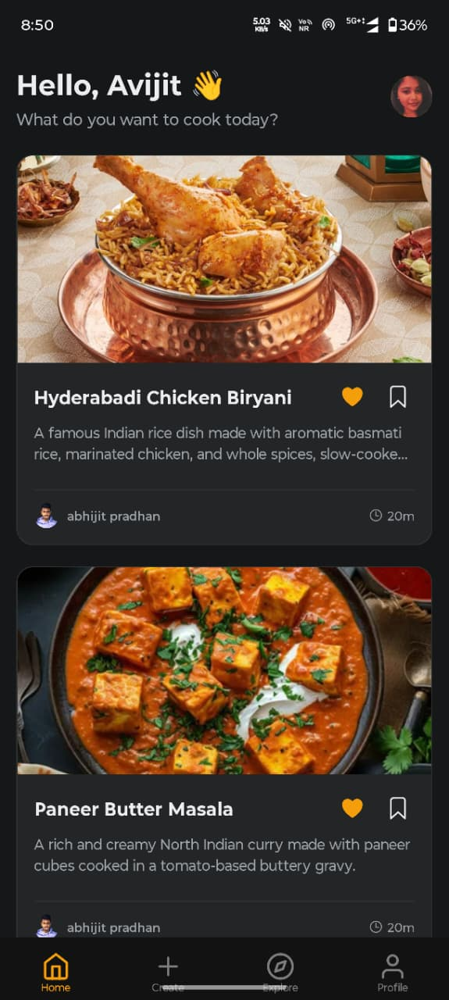

# CookMate Website

The official landing page for the [CookMate](https://github.com/avijit969/cookmate) mobile application. This modern, responsive website showcases the app's features and provides a direct download link for users.

<!--  -->

## ✨ Features

- **Modern UI/UX**: Built with a sleek, glassmorphism-inspired design system.
- **Responsive Design**: Fully responsive layout that works perfectly on desktop, tablet, and mobile devices.
- **Dark Mode**: Native support for light and dark modes, respecting system preferences.
- **Interactive Elements**: Smooth animations, hover effects, and a 3D interactive phone mockup.
- **Performance**: Optimized with Next.js App Router and server-side rendering for blazing fast load times.

## 🛠️ Tech Stack

- **Framework**: [Next.js 16](https://nextjs.org/) (App Router)
- **Language**: [TypeScript](https://www.typescriptlang.org/)
- **Styling**: [Tailwind CSS v4](https://tailwindcss.com/)
- **Icons**: [Heroicons](https://heroicons.com/) (SVG)
- **Deployment**: Vercel (Recommended)

## 🚀 Getting Started

Follow these steps to run the project locally.

### Prerequisites

- Node.js 18.17 or later
- npm or yarn

### Installation

1.  **Clone the repository**
    ```bash
    git clone https://github.com/avijit969/cookmate-website.git
    cd cookmate-website
    ```

2.  **Install dependencies**
    ```bash
    npm install
    ```

3.  **Start the development server**
    ```bash
    npm run dev
    ```

4.  **Open in Browser**
    Navigate to [http://localhost:3000](http://localhost:3000) to view the site.

## 📜 Scripts

- `npm run dev`: Runs the app in development mode.
- `npm run build`: Builds the app for production.
- `npm run start`: Starts the production server.
- `npm run lint`: Runs the linter to check for code quality issues.

## 📂 Project Structure

```
cookmate-website/
├── app/                  # Next.js App Router directory
│   ├── globals.css       # Global styles and Tailwind configuration
│   ├── layout.tsx        # Root layout with metadata and fonts
│   └── page.tsx          # Main landing page component
├── components/           # Reusable UI components
│   └── PhoneMockup.tsx   # CSS-based 3D phone mockup component
├── public/               # Static assets (images, icons)
└── package.json          # Project dependencies and scripts
```

## 🤝 Contributing

Contributions are welcome! Please feel free to submit a Pull Request.

## 📄 License

This project is licensed under the MIT License.
